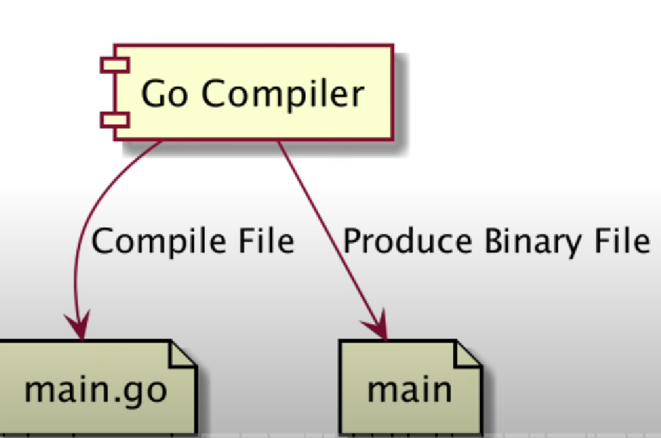
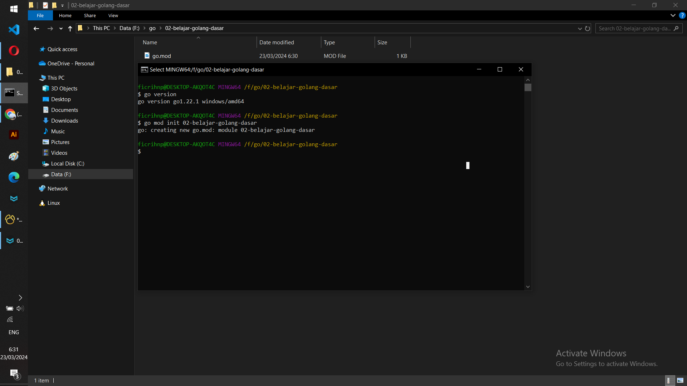
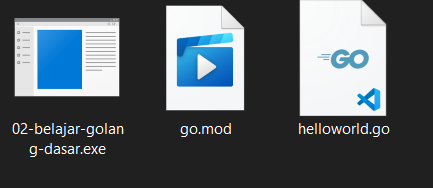
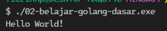
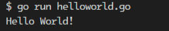
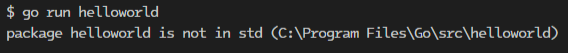
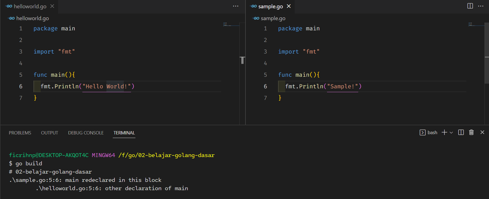

# DASAR - DASAR GOLANG

## Sejarah Go

- Dibuat di Google menggunakan bahasa pemrograman C

- Di Rilis ke public sebagai open source pada tahun 2009

- Go-Lang populer sejak digunakan untuk membuat Docker pada tahun 2011

- Saat ini mulai banyak teknologi baru yang dibuat menggunakan bahasa Go-lang dibanding bahasa C, seperti Kubernetes, Prometheus, CockroachDB dan lain-lain.

- Saat ini mulai populer untuk pembuatan Backend API di microservice.

## Kenapa Belajar Go-lang?

- Bahasa Go-Lang sangat sederhana, tidak butuh waktu lama untuk mempelajarinya.

- Go-Lang mendukung baik `concurrency programming`, dimana saat ini kita hidup di zaman `multicore processor`.

- Go-Lang mendukung `garbage collector`, sehingga tidak butuh melakukan management memory secara manual seperti bahasa C.

- Salah satu bahasa pemrograman yang sedang naik daun.

## Proses Development Program Go-Lang

- Go Compiler - adalah sebuah aplikasi yang digunakan untuk melakukan compilasi kode program go-langnya. 

- Ekstensi file adalah `main.go`, compiler akan digunakan untuk melakukan kompilasi terhadap file `main.go` tersebut.

- Hasilnya akan menajadi sebuah `Binary File`/`Native File` dan dapat di compile untuk berbagai sistem operasi spesifik semisal `Mac Os`, `Linux` dll.



## Menginstall Go-Lang

- Untuk menginstall `golang` dapat mendonwload di link berikut: [link](https://go.dev/dl/)

- Download Compiler `golang`

- Install Compiler `golang`

- Cek  menggunakan perintah: 
  
  ```bash
  go version
  # maka akan mengeluarkan output version dari go itu sendiri
  go version go1.21.3 darwin/arm64
  ```

## Text Editor atau IDE

- Visual Studio Code.

- JetBrains Goland.

## Membuat Project Baru Golang

- Untuk membuat project baru `golang`, `golang` sudah menyediakan perintahnya dengan menjalankan perintah atau command:

```bash
go mod init {nama_project}
```

contoh:

```bash
go mod init belajar-golang-dasar
```

- Untuk flownya:
  
  - Buatkan terlebih dahulu nama projectnya: contoh disini menggunakan folder `belajar-golang-dasar`
  
  - Lalu masuk ke dalam folder tersebut.
  
  - Dan lalu menjalankan perintah untuk membuat project baru golang:
    
    `go mod init belajar-golang-dasar`

- Hasilnya:
  
  

## Main Function

- Main function adalah file root/index pada saat project di build. Sama halnya dengan Java.

- Golang, itu mirip bahasa pemrograman C/C++, dimana perlu ada yang namaya main function.

- Main function adalah sebuah funcgsi yang akan dijalankan ketika program berjalan.

- Untuk membuat function, kita bisa menggunakan kata kunci func.

- Main function harus terfapat didalam main package

- Titik koma di Golang, tidaklah wajib,artinya kita dapat menambahkan titik koma atau tidak, diakhir.

### Membuat Main function

- Untuk membuat `main function` dapat menuliskan kode seperti ini. 
  
  ```go
  package main // WAJIB DISERTAKAN
  
  func main(){
  }
  ```

- Untuk memberi tahu kalo ini adalah `main function` maka diharuskan untuk menyertakan `package main`. Lalu setelah itu deklarasi `main function`-nya.

### Menampilkan `Hello World!`

- Untuk menampilkan output `Hello World!` dalam bahasa go. Kita dapat menggunakan module `fmt`, module ini mempunyai function `Println` yang dapat menampilkan output ke terminal ketika dieksekusi atau di run programnya.
  
  ```go
  package main // WAJIB DISERTAKAN
  
  import "fmt"
  
  func main(){
      fmt.Println("Hello World!")
  }
  ```

### Mem-build program dan menjalankan program

- Untuk mem-build program dalam go, dapat menggunakan perintah:
  
  ```bash
  go build
  ```

- Maka nanti akan dibuatkan file berupa hasil dari kompilasi dengan output binary dan sesuai dengan sistem operasi yang digunakan apabila menggunakan windows maka akan dibuatkan dengan ekstensi `.exe` dll.
  
  

- Untuk menjalankan atau *run* program tersebut, dapat menggunakan perintah:
  
  ```bash
  ./02-belajar-golang-dasar.exe
  Hello World!
  ```
  
  

### Menjalankan tanpa build program

- Dalam golang juga dapat menjalankan program tanpa harus mem-*build* nya. Untuk menjalankannya dengan melakukan perintah:
  
  ```bash
  go run {nama_file_go_beserta_extensionnya}
  ```
  
  Contoh
  
  ```bash
  go run helloworld.go
  ```

- Output
  
  

- Perlu diperhatikan untuk memberikan ekstension filenya apabila tidak menggunakan extension filenya maka akan terjadi error pada saat dieksekusi programnya.
  
  

## Multiple Main Function

- Di golang, function dalam module / project adalah unik, artinya kita tidak boleh membuat nama function yang sama.

- Oleh karena itu, jika kita membuat file baru, misal `sample.go`, lalu membuat nama functuin yang sama yaitu main.

- Maka kita tidak bisa melakukan build module, karena function tersebut duplikat dengan yang ada di main function `helloworld.go`

- Contoh pada saat dieksekusi: Proses gagal dengan menunjukan compiler error `main redeclared in this block`
  
  

### Solusinya

- Karena saat ini dalam tahapan belajar maka kita hanya fokus menjalankan file golang satu per satu, sehingga tidak akan terjadi error jika dijalankan filenya satu persatu.

- Tapi! perlu diingat, pada kenyataannya nanti, saat kita membuat project, kita hanya akan membuat satu main function saja.

- Contoh menjalankan file secara satu persatu: 
  
  ```bash
  go run sample.go
  go run helloworld.go
  ```

## Tipe Data

### Tipe Data Number

- Tipe data number dibagi menjadi 2, yaitu:
  
  - Integer, bilangan bulat
  
  - Floating Point, bilangan desimal

#### Tipe Data Number - Integer

| Tipe Data | Nilai Minimum        | Nilai Maksimum      |
| --------- | -------------------- | ------------------- |
| int8      | -128                 | 127                 |
| int16     | -32768               | 32767               |
| int32     | -2147483648          | 2147483647          |
| int64     | -9223372936854775808 | 9223372936854775807 |

#### Tipe Data Number - Unsigned Integer

| Tipe Data | Nilai Minimum | Nilai Maksimum       |
| --------- | ------------- | -------------------- |
| uint8     | 0             | 255                  |
| uint16    | 0             | 65535                |
| uint32    | 0             | 4294967295           |
| uint64    | 0             | 18446744073709551615 |

#### Tipe Data Floating Point

| Tipe Data  | Nilai Minimum                                          | Nilai Maksimum         |
| ---------- | ------------------------------------------------------ | ---------------------- |
| float32    | 1.18x10<sup>-38</sup>                                  | 3.4x10<sup>38</sup>    |
| float64    | 2.23x10<sup>-308</sup>                                 | 1.80x10<sup>-308</sup> |
| complex64  | complex numbers with float32 real and imaginary parts. |                        |
| complex128 | complex numbers with float64 real and imaginary parts. |                        |

#### Alias

| Tipe Data | Alias untuk    |
| --------- | -------------- |
| byte      | uint8          |
| rune      | int32          |
| int       | Minimal int32  |
| uint      | Minimal uint32 |

### Menampilkan output number

- Untuk menampilkan output number dengan tipe data `int` dan `float`, dapat membuat file dengan nama `number.go`. Dan menuliskan perintah berikut:
  
  ```go
  package main
  
  import "fmt"
  
  func main(){
   fmt.Println("Satu: ", 1);
   fmt.Println("Dua: ", 2);
   fmt.Println("Tiga Koma Lima: ", 3);
  }
  ```

- Eksekusi program dan output
  
  ```bash
  go run number.go 
  Satu: 1
  Dua: 2
  Tiga Koma Lima: 3.5
  ```

### Tipe Data Boolean

- Tipe data `boolean` adalah tipe data dengan nilai : `true` dan `false`.

- Tipe data boolean direpresentasikan menggunakan kata kunci `bool`.
  
  | Nilai Boolean | Keterangan |
  | ------------- | ---------- |
  | true          | Benar      |
  | false         | Salah      |

### Menampilkan Output Boolean

- Untuk menampilkan output `boolean`, dapat membuat file dengan nama `boolean.go`. Dan menuliskan perintah berikut:
  
  ```go
  package main
  
  import "fmt"
  
  func main(){
   fmt.Println("Benar: ", true)
   fmt.Println("Salah: ", false)
  }
  ```

- Eksekusi program dan output
  
  ```bash
  go run boolean.go
  Benar: true
  Salah: false
  ```

### Tipe Data String

- String adalah tipe data kumpulan karakter

- Jumlah karakter di dalam String bisa nol sampai tidak terhingga

- Tipe data String di Go-Lang direpresentasikan dengan kata kunci string

- Nilai data String di Go-Lang selalu diawali dengan karakter `"` (*petik dua*) dan diakhiri dengan `"` (*petik dua*).

### Menampilkan Output String

- Untuk menampilkan output `string`, dapat membuat file dengan nama file `string.go`. Dan menuliskan perintah berikut:
  
  ```go
  package main 
  
  import "fmt"
  
  func main(){
      fmt.Println("Ini adalah string ke - 1!")
      fmt.Println("Ini adalah string ke - 2!")
      fmt.Println("Ini adalah string ke - 3!")
  }
  ```

- Eksekusi progran dan outputnya:
  
  ```bash
  go run string.go
  Ini adalah string ke - 1!
  Ini adalah string ke - 2!
  Ini adalah string ke - 3!
  ```

### Function untuk String

| Function         | Keterangan                                                                                      |
| ---------------- | ----------------------------------------------------------------------------------------------- |
| len("string")    | Menghitung jumlah karakter di String, kalaupun ada karakter white space tetap dihitung.         |
| "string"[number] | Mengambil karakter pada posisi yang ditentukan, dan mengembalikan byte, dimulai dari posisi `0` |

### Menampilkan Function untuk String

- Untuk menampilkan output `function untuk string`, dapat membuat file dengan nama file `string.go`. Dan menuliskan perintah berikut:
  
  ```go
  package main
  
  import "fmt"
  
  func main(){
      fmt.Println(len("Berapa karakter ini: ");
      fmt.Println("Bangef"[0]);
      fmt.Println("Bangef AS Ficri Hanip"[10]);
  }
  ```

- Eksekusi program dan outputnya:
  
  ```bash
  go run string.go
  21
  70
  66
  ```

## Variable

- Variable adalah tempat untuk menyimpan data

- Variable digunakan agar kita bisa mengakses data yang sama, jika kita ingin menyimpan data yang berbeda-beda jenis, kita harus membuat variable.

- Untuk membuat variable, kita bisa menggunakan kata kunci `var`, lalu diikuti dengan nama variable dan tipe datanya.

### Menampilkan variable

- Untuk menampilkan output `variable`, dapat membuat file dengan nama file `variable.go`. Dan menuliskan perintah berikut:
  
  ```go
  package main
  
  import "fmt"
  
  func main(){
      var name string // deklarasi
  
      name = "Bangef" // inisialisasi
      fmt.Println(name)
  
      name = "Ficri Hanip"
      fmt.Println(name)
  
      // ADAPUN APABILA INGIN LANGSUNG DEKLARASI 
      // SEKALIGUS INISIALISASI DAPAT DILAKUKAN SEPERTI INI
      var age int = 20;
      fmt.Println("Umur saya: ", age)
  
      // APABILA TIDAK MENYERTAKAN TIPE DATANYA PUN TIDAK MENJADIKAN ERROR
      // KONDISI INI BERLAKU APABILA VARIBLE LANGSUNG DI DEKLARASI DAN INISILISASI VALUENYA
      var height = 170
      fmt.Println("Tinggi saya: ", height)
  }
  ```

- Eksekusi program dan outputnya:
  
  ```bash
  go run variable.go
  Bangef
  Ficri Hanip      
  Umur saya:  20   
  Tinggi saya:  170
  ```

### Error Variable

- Ada beberapa error dalam penulisan variable, kasusnya:
  
  - Apabila tidak menuliskan tipe data
  
  ```go
  package main
  
  import "fmt"
  
  func main(){
      var name string
  
      name = "Bangef"
      fmt.Println(name)
  
      name = "Ficri Hanip"
      fmt.Println(name)
  
      // ADAPUN APABILA INGIN LANGSUNG INISIALISASI 
      // SEKALIGUS DEKLARASI DAPAT DILAKUKAN SEPERTI INI
      var age int = 20
      fmt.Println("Umur saya: ", age)
  
      // APABILA TIDAK MENYERTAKAN TIPE DATANYA PUN TIDAK MENJADIKAN ERROR
      // KONDISI INI BERLAKU APABILA VARIBLE LANGSUNG DI INSILISASI DAN DEKLARASI VALUENYA
      var height = 170
      fmt.Println("Tinggi saya: ", height)
  
      // APABIALA TIDAK MENGINSIALISASI TIPE DATANYA MAKA AKAN TERJADI ERROR
      var weight
      weight = 70
      fmt.Println("Berat massa saya: ", weight)
  }
  ```
  
  ```bash
  # command-line-arguments
  .\variable.go:25:13: syntax error: unexpected newline, expected type
  ```
  
  - Apabila variable tidak terpakai
  
  ```go
  package main
  
  import "fmt"
  
  func main(){
      var name string
  
      name = "Bangef"
      fmt.Println(name)
  
      name = "Ficri Hanip"
      fmt.Println(name)
  
      // ADAPUN APABILA INGIN LANGSUNG INISIALISASI 
      // SEKALIGUS DEKLARASI DAPAT DILAKUKAN SEPERTI INI
      var age int = 20
      fmt.Println("Umur saya: ", age)
  
      // APABILA TIDAK MENYERTAKAN TIPE DATANYA PUN TIDAK MENJADIKAN ERROR
      // KONDISI INI BERLAKU APABILA VARIBLE LANGSUNG DI INSILISASI DAN DEKLARASI VALUENYA
      var height = 170
      fmt.Println("Tinggi saya: ", height)
  
      // APABILA VARIABLE TIDAK DIGUNAKAN
      var weigth int
      weigth = 70
  }
  ```
  
  ```bash
  # command-line-arguments
  .\variable.go:30:6: weigth declared and not used
  ```

## Kata Kunci Var

- Di golang kata kunci `var` saat membuat variable tidak lah wajib.

- Asalkan saat membuat variable kita langsung menginisialisasi datanya.

- Agar tidak perlu menggunakan kata kunci `var`, kita perlu menggunakan kta kunci `:=` saat menginisialisasi data pada variable tersebut.

### Menampilkan kata kunci var dengan menggantikannya menggunakan `:=`

- Dapat me-*refactoring* file `variable.go`, dengan menggantikan semua kata kunci `var` dengan menerapkan `:=`. Dengan menuliskan perintah berikut:
  
  ```go
  package main
  
  import "fmt"
  
  func main(){
  
      // REFACTORING UNTUK MENGGANTIKAN KATA KUNCI VAR DENGAN ":="
      // DAPAT DILAKUKAN HANYA SAAT PENDEKLARASIAN DAN INISILISASI VRAIBLE
      name := "Bangef"
      age := 20
      height := 170
  
      fmt.Println(name)
      name = "Ficri Hanip"
      fmt.Println(name)
      fmt.Println("Umur saya: ", age)
      fmt.Println("Tinggi saya: ", height)
  }
  ```

- Eksekusi program dan outputnya:
  
  ```bash
  go run variable.go
  Bangef
  Ficri Hanip      
  Umur saya:  20   
  Tinggi saya:  170
  ```

## Multiple Variable

- Dalam golang kita dapat menggunakan `multiple variable`, agar kemudahan untuk membaca kode nya.

- Dapat me-*refactor* file `varible.go`
  
  ```go
  package main
  
  import "fmt"
  
  func main(){
  
      var (
          name = "Bangef"
          age = 20
          height = 170
      )
  
      fmt.Println(name)
      name = "Ficri Hanip"
      fmt.Println(name)
      fmt.Println("Umur saya: ", age)
      fmt.Println("Tinggi saya: ", height)
  ```

## Constant

- Constant adalah varibale yang nilainya tidak bisa diubah setelah pertama kali diberi nilai.

- Cara pembuatan constant mirip dengan variable, yang membedakan hanya kata kunci yang digunakan adalah `const`, bukan `var`.

- Saat pembuatan constant, kita wajib langsung  menginisilisasi datanya.

- Perbedaan antara constant dan variable :
  
  - Variable dapat di assign ulang, sedangkan constant hanya dapat diassign sekali dan tidak dapat diassign ulang.
  
  - Variable akan error ketika tidak digunakan, constant tidak akan error apabila tidak digunakan.

### Menampilkan output Constant

- Buat file `constant.go`, lalu tuliskan perintah dibawah ini:
  
  ```go
  package main
  
  import "fmt"
  
  func main(){
      const name string = "Bangef"
      // ATAU SEPERTI INI
      const name2 = "Bangef 2"
      // TAMPILKAN ATAU CETAK
      fmt.Println(name)
      fmt.Println(name2)
  }
  ```

- Eksekusi program dan outputnya:
  
  ```bash
  go run constant.go
  Bangef
  Bangef 2
  ```

## Multiple Constant

- Dalam golang kita dapat menggunakan `multiple constant` ini sama hanlnya dengan `variable`, agar kemudahan untuk membaca kode nya.

- Dapat me-*refactor* file `constant.go`
  
  ```go
  package main
  
  import "fmt"
  
  func main(){
  
      const (
          name = "Bangef"
          name2 = "Bangef 2"
      )
      fmt.Println(name)
      fmt.Println(name2)
  }
  ```

## Konversi Tipe Data

- Di golang kadang dibutuhkan untuk konversi tipe data dari satu tiper ke tipe lain.

- Misal ingin mengkonversi tipe data int32 ke int64, dan lain-lain.

- Untuk mengkonversi tipe data di golang, kita dapat menggunakan nama tipe data lalu `()` *kurung buka dan kurung tutup* contohnya: `int64(nilai_yang_ingin_dikonversi)`.

### Menampilkan output konversi tipe data

- Buat file `konversi.go`, lalu tuliskan perintah dibawah ini:
  
  ```go
  package main
  
  import "fmt"
  import "reflect" // ADALAH PAKET UNTUK MEMERIKSA DATA SECARA DINAMIS PADA SAAT RUNTIME
  
  func main(){
  	var(
  		nilai32 int32 = 32768
  		nilai64 int64 = int64(nilai32)
  		nilai16 int16 = int16(nilai32)
  
  		name string = "BAba"
  		e = name[0]
  		eString = string(e)
  	)
  
  	fmt.Println(nilai32)
  	fmt.Println(nilai64)
  	fmt.Println(nilai16)
  	fmt.Println(name)
  	// AKAN MENAMPILKAN TIPE DATA BYTE ATAU ALIAS DARI unit8
  	fmt.Println(e, ", dengan tipe data:", reflect.TypeOf(e))
  	fmt.Println(eString)
  }
  ```

- Eksekusi program dan outputnya:
  
  ```bash
  go run konversi.go
  32768
  32768
  -32768
  BAba
  66 , dengan tipe data: uint8
  B
  ```

### Number Overflow

- Nilai yang tidak sesuai akan jangkauannya, maka akan kembali ke jangkauan paling bawahnya.
  
  ```go
  package main
  
  import "fmt"
  
  func main(){
   	var(
  		nilai32 int32 = 32768
  		nilai64 int64 = int64(nilai32)
  		nilai16 int16 = int16(nilai32)
  	)
      
      fmt.Println(nilai32)
      fmt.Println(nilai64)
      fmt.Println(nilai16)
  }
  ```

- Eksekusi program dan outputnya:
  
  ```bash
  go run konversi.go
  32768
  32768
  -32768
  ```

## Type Declaration

- Type Declaration adalah kemampuan membuat ulang tipe data baru dari tipe dara yang sudah ada.

- Type Declaration biasanya digunakan untuk membuat alias terhadap tipe data yang sudah ada dengan tujuan agar lebih mudah dimengerti.

### Menampilakan Type Declaration

- Buat file `type_declaration.go`, dan tuliskan perintah berikut:
  
  ```go
  package main
  
  import (
  	"fmt"
  	"reflect"
  )
  
  func main(){
  	// INI ADALAH ALIAS ATAU NAMA LAIN DARI TIPE DATA STRING
      type NoKtp string
  
  	var ktpBangef NoKtp = "111111111"
  
  	fmt.Println(ktpBangef, "tipe data:", reflect.TypeOf(ktpBangef))
  	// KONVERSI DARI TIPE DATA STRING KE NoKtp
  	fmt.Println(NoKtp("22222222"), "tipe data:", reflect.TypeOf(NoKtp("22222222")));
  }
  ```

- Eksekusi program dan outputnya:
  
  ```bash
  go run type_declaration.go
  111111111 tipe data: main.NoKtp
  22222222 tipe data: main.NoKtp
  ```

## Operasi

### Operasi Matematika

- Sama halnya dengan bahasa pemrograman lain
  
  | Operator | Keterangan     |
  | -------- | -------------- |
  | +        | Penjumlahan    |
  | -        | Pengurangan    |
  | *        | Perkalian      |
  | /        | Pembagian      |
  | %        | Sisa Pembagian |

#### Menampilkan Operasi Matematika

- Buat file `operand_math.go`, lalu tuliskan perintah:
  
  ```go
  package main
  
  import (
  	"fmt"
  	"math/rand" // PAKET UNTUK MENDAPATKAN RANDOM NUMBER 
  )
  
  func main(){
  	var(
  		a int = rand.Intn(50) // UNTUK GENERATE RANDOM INT
  		b int = rand.Intn(50)
  		c int = rand.Intn(50)
  		d int = rand.Intn(50)
  		result int
  	)
  
  	fmt.Println("All Data: a =>",a, ", b =>", b, ", c =>", c, ", d =>", d)
  	result = a + b * c - d
  	fmt.Println("Formula: a + b * c - d, Hasilnya:", result)
  }
  ```

- Eksekusi program dan outputnya:
  
  ```bash
  go run operand_math.go
  All Data: a => 5 , b => 7 , c => 41 , d => 19
  Formula: a + b * c - d, Hasilnya: 273
  ```

### Operasi *Augmented Assignments*

- Adalah operasi yang dilakukan ke dirinya sendiri
  
  | Operasi Matemetika | Augmented Assignments |
  | ------------------ | --------------------- |
  | a = a + 10         | a += 10               |
  | a = a - 10         | a -= 10               |
  | a = a * 10         | a *= 10               |
  | a = a / 10         | a /= 10               |
  | a = a % 10         | a %= 10               |

#### Menampilkan Augmented Assignments

- Buat file `operand_augmented_assignment.go`, lalu tuliskan perintah:
  
  ```go
  package main
  
  import (
  	"fmt"
  )
  
  func main(){
  	a := 100
  	fmt.Println(a)
  	a += 20
  	fmt.Println(a)
  	a -= 20
  	fmt.Println(a)
  	a *= 20
  	fmt.Println(a)
  	a /= 20
  	fmt.Println(a)
  	a %= 3
  	fmt.Println(a)
  }
  ```

- Eksekusi program dan outputnya:
  
  ```bash
  go run operand_augmented_assignment.go
  100
  120
  100
  2000
  100
  1
  ```

### Operasi *Unary*

- Adalah operasi yang hanya memiliki satu operator saja.
  
  | Operator | Keterangan        |
  | -------- | ----------------- |
  | ++       | a = a + 1         |
  | --       | a = a - 1         |
  | -        | Negative          |
  | +        | Positive          |
  | !        | Boolean kebalikan |

#### Menampilkan Operasi *Unary*

- Buat file `operand_unary.go`, lalu tuliskan perintah:
  
  ```go
  package main
  
  import (
  	"fmt"
  )
  
  func main(){
  	i := 1
  	fmt.Println(i)
  	i++
  	fmt.Println(i)
  	i++
  	i++
  	i++
  	fmt.Println(i)
  }
  ```

- Eksekusi program dan outputnya:
  
  ```bash
  go run operand_unary.go 
  1
  2
  5
  ```
